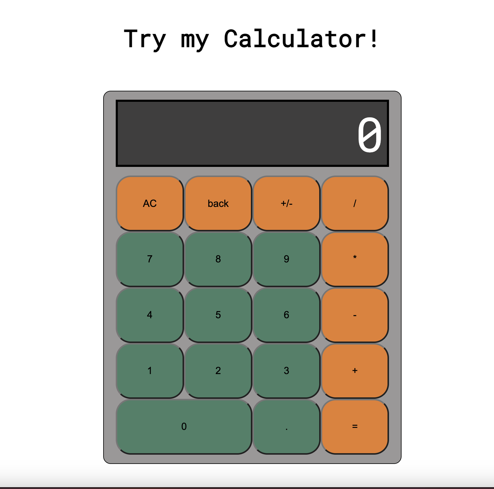

# Calculator

## Overview
Welcome to my calculator project! This simple calculator is built with HTML, CSS, and JavaScript. It provides basic arithmetic operations, including addition, subtraction, multiplication, and division. The calculator features a clean and user-friendly interface, making it easy to perform calculations.

## Preview
[Click here to try the calculator](https://calculator-leead.netlify.app/)

## Usage
1. Clone the repository to your local machine.
2. Open the `index.html` file in a web browser.
3. Use the calculator to perform calculations.

## Features
- Addition (+), subtraction (-), multiplication (*), and division (/).
- AC button to clear all input.
- Back button to remove the last entered digit.
- +/- button to toggle between positive and negative values.
- Responsive design for various screen sizes.

## Technologies Used
- HTML
- CSS
- JavaScript

## Styling
The calculator uses the "Roboto Mono" font for a clean and modern look. The interface is designed to be intuitive and user-friendly.

## Developer
- Leead Jacobowitz

## License
This project is licensed under the MIT License - see the [LICENSE.md](LICENSE.md) file for details.

Feel free to explore, use, and contribute to this calculator project. Happy calculating!
