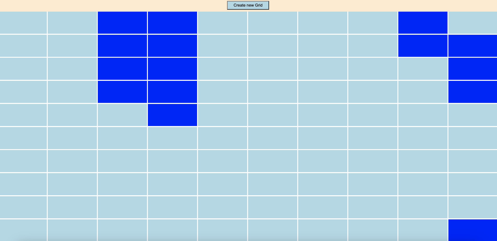

# Etch-A-Sketch Project

## Introduction
In this project, you’ll be creating a pretty neat toy to flex your DOM manipulation skills. You're going to build a browser version of something between a sketchpad and an Etch-A-Sketch.

## Project Goals
1. Create a webpage with a 16x16 grid of square divs.
2. Set up a "hover" effect so that the grid divs change color when your mouse passes over them, leaving a (pixelated) trail through your grid like a pen would.
3. Add a button to the top of the screen that will send the user a popup asking for the number of squares per side for the new grid. Once entered, the existing grid should be removed, and a new grid should be generated in the same total space as before (e.g., 960px wide) so that you've got a new sketch pad.

## Instructions
1. Download the repo and open the `index.html` file in your web browser or click on the following link to start the Etch-A-Sketch application.: https://etch-a-sketch-leead.netlify.app/ 
2. Hover over the square divs in the grid to draw and create pixelated trails.
3. Click the button at the top of the screen to customize the grid size for a new sketch pad.

Feel free to explore and have fun with your Etch-A-Sketch!

