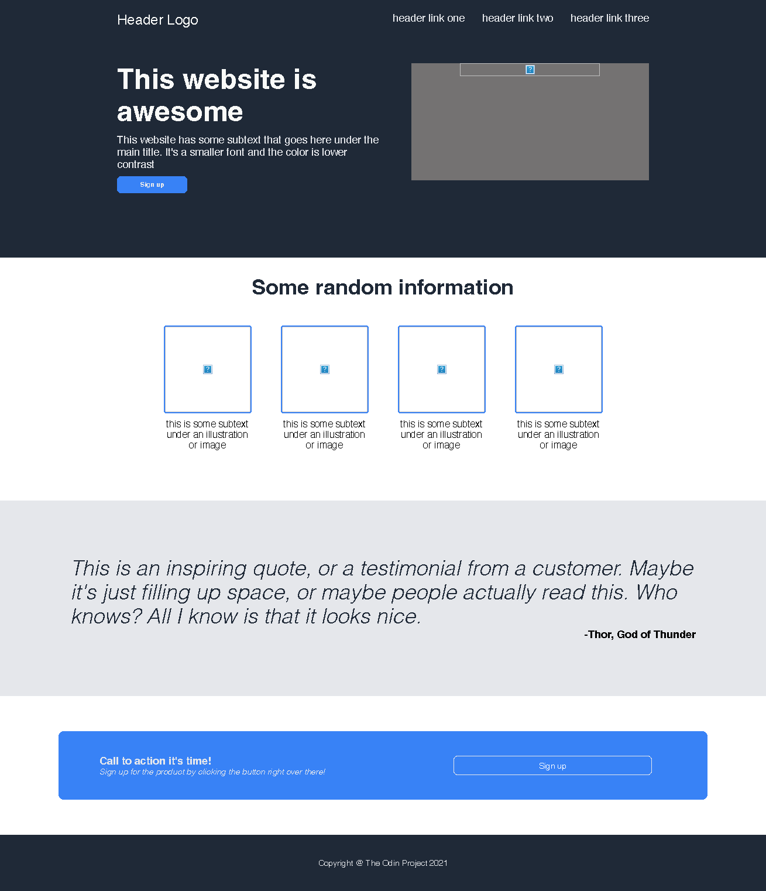

<h3>In this project, I created my first full web page based only on HTML and CSS. The goal to try taking an image shown, and creating the full page while using methods like flexbox properly. 
Here is my final result compared to the original image given.<h3>

<h1>Original:

---
<h1>My page:
